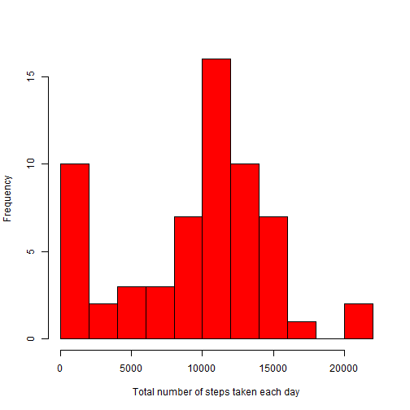
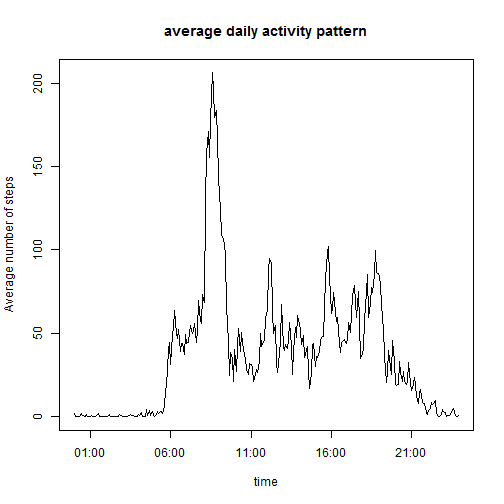
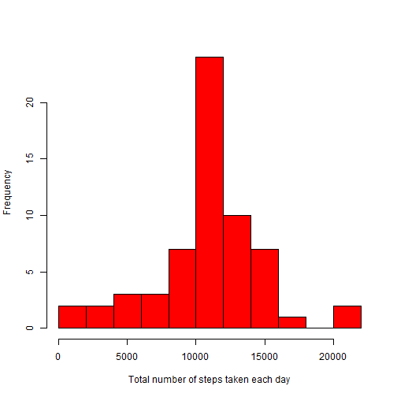
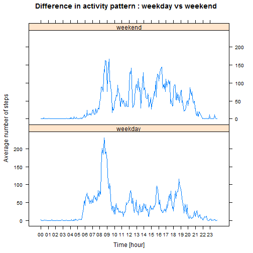

## Introduction

This repport is part of the programming assignement 1 of the "Reproducible Research" Course on Coursera.

We analyse data from a personal activity monitoring device. This device collects data at 5 minute intervals through out the day. The data consists of two months of data from an anonymous individual collected during the months of October and November, 2012 and include the number of steps taken in 5 minute intervals each day.

The data for this assignment can be downloaded [Here] [1].  
The variables included in this dataset are:

* *steps*: Number of steps taking in a 5-minute interval (missing values are coded as NA)
* *date*: The date on which the measurement was taken in YYYY-MM-DD format
* *interval*: Identifier for the 5-minute interval in which measurement was taken

The dataset is stored in a comma-separated-value (CSV) file and there are a total of 17,568 observations.

[1]: https://d396qusza40orc.cloudfront.net/repdata%2Fdata%2Factivity.zip

## pre-requisite

The file containing the dataset, named "activity.csv", is assumed to be located
in R working directory.

Throughout the analysis we use the following packages.

```r
library(data.table)
library(lubridate)
library(lattice)
```

## Loading and preprocessing the data

The following R code loads the dataset.
The *date* variable is converted to POSIXct and *interval* padded with 0.


```r
data          <- fread("activity.csv")
data$date     <- ymd(data$date)
data$interval <- formatC(data$interval, width = 4, format = "d", flag = "0")
```

## Mean total number of steps taken per day

We compute the total number of steps for each day, storing the result in the
data table *step.per.day*. We compute the mean and median of the total number of
steps and plot the histogram.


```r
step.per.day        <- data[, list(total.steps = sum(steps, na.rm = TRUE)), by = date]
mean.total.step     <- mean(step.per.day$total.steps, na.rm = TRUE)
median.total.step   <- median(step.per.day$total.steps, na.rm = TRUE)

hist(step.per.day$total.steps, xlab = "Total number of steps taken each day",
     col = "red", breaks = 15, main = "")
```

 

The mean total number of steps taken per day is 9354 and the median
is 10395.

## Average daily activity pattern

We compute the average number of steps by time interval (averaged across all the
days in the dataset). Result is stored in the data table *agg.data*.
We plot the mean number of step per interval and find the
5-minute interval containing the maximum number of steps.


```r
agg.data <- data[, list(steps = mean(steps, na.rm = TRUE)), by = interval]

# convert interval to POSIXct
agg.data <- agg.data[, time := as.POSIXct(interval, format = "%H%M")]
# plot
with(agg.data, plot(time, steps, type = "l", 
                    main = "average daily activity pattern",
                    xlab = "time", ylab = "Average number of steps"))
```

 

```r
# find interval with maximum number of steps
rush.time.end   <- agg.data[which.max(agg.data$steps), time]
rush.time.start <- rush.time.end - minutes(5)
```
The 5-minute interval containing the maximum number of steps is from 
8:30 to 
8:35, with in average 
206 steps.

## Imputing missing values

The dataset presents a number of incomplete observations, which can be computed as follows


```r
total.na <- sum(!complete.cases(data))
```
Over the 17568 observations in the dataset, 2304 are incomplete 
(i.e. the number of steps is missing). We want to fill in these missing values and
observe the impact on the total number of steps taken each day.

We substitute the missing values from the average daily activity pattern computed
previously. This is, if the number of steps is missing for a given interval, we 
use the average number of steps for this interval from *agg.data*. This is done in 
a copy of the dataset named *new.data* as follows:


```r
new.data <- data  # create copy of dataset

# replace NA with the mean for the corresponding 5-minutes interval
new.data$steps <- ifelse(is.na(new.data$steps), 
                         agg.data$steps[match(new.data$interval, agg.data$interval)],
                         new.data$steps)
```
We then want to see how this changes the statistics of mean total number of step
 per day. To this end We compute the total number of steps for each day with the
 new dataset, storing the result in the data table *step.per.day2*.
 We compute as before the mean and median and plot the histogram. 
 

```r
step.per.day2        <- new.data[, list(total.steps = sum(steps, na.rm = TRUE)), by = date]
mean.total.step2     <- mean(step.per.day2$total.steps, na.rm = TRUE)
median.total.step2   <- median(step.per.day2$total.steps, na.rm = TRUE)

hist(step.per.day2$total.steps, xlab = "Total number of steps taken each day",
     col = "red", breaks = 15, main = "")
```

 

The mean total number of steps taken per day is now 10766
and the median is 10766.
Previous values were 9354 for the mean and
10395 for the median.
Therefore, imputing missing values with our strategies increases both the mean and median, and
at the same time brings them closer to each other.

## Differences in activity patterns between weekdays and weekends

We finally want to study how the dayly activity pattern changes between weekday
and weekend. TO do this we add a new factor variable *dayType* to the dataset 
with two levels – “weekday” and “weekend” indicating whether a given date is a weekday or weekend day.
We then aggregate the mean number of step per time interval and dayType.
This allows us to plot the average activity patterns for weekday and weekend.


```r
# define a new factor variable daytType = "weekday" or "weekend"
new.data <- new.data[, dayType := factor(ifelse(wday(date) %in% c(1,7), "weekend", "weekday"))]

# aggregate data by interval and dayType
agg.data.per.daytype <- new.data[, list(steps = mean(steps, na.rm = TRUE)), by = list(interval,dayType)]
agg.data.per.daytype$interval <- as.POSIXct(agg.data.per.daytype$interval, format = "%H%M")

# plot activity pattern for weekday and weekend

# set x-axis format
with(agg.data.per.daytype, sek <<- seq( interval[1], interval[length(interval)], by="1 hour"))
x.position <- as.numeric(sek)
x.label <- format(sek, "%H", drop0trailing = TRUE)

# plot
xyplot(steps ~ interval | dayType, data = agg.data.per.daytype, type = "l", layout = c(1,2),
       main = "Difference in activity pattern : weekday vs weekend", xlab = "Time [hour]",
       ylab = "Average number of steps", scales=list(x=list(at= x.position,labels=x.label)))
```

 

Here we can observe that :

* The individual tends to get up and go to sleep latter on weekend compare to weekday
* The activity seems in average more intense during weekend


